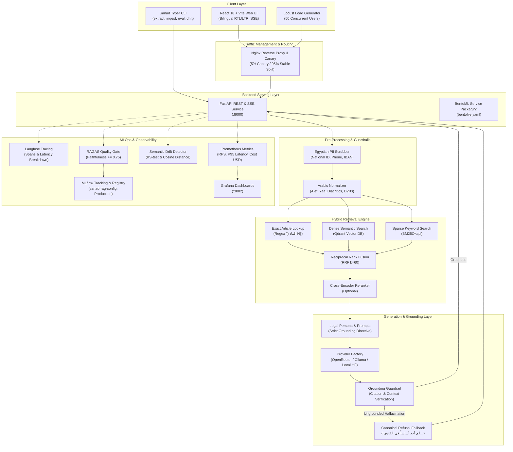

# Sanad (سند) — Arabic Legal Q&A System

[](https://github.com/iti-mlops-mena)
[](.github/workflows/ci.yml)
[](backend/tests/)
[](backend/pyproject.toml)
[](frontend/)
[](https://qdrant.tech/)

> **سند (Sanad)** هو نظام بحث واستشارات قانونية مدعوم بالذكاء الاصطناعي موجه إلى **القانون المدني المصري (قانون رقم 131 لسنة 1948)**.  
> يقوم النظام باسترجاع النصوص القانونية بدقة فائقة والإجابة حصراً منها مع توثيق أرقام المواد (مثل `[المادة 147]`). في حالة عدم كفاية النص القانوني المسترجع، يمتنع النظام قطعياً عن التأليف أو التخمين ويعلن تعذر وجود أساس قانوني.

---

## 📌 Project Highlights

- **1,149 Articles Full Coverage**: Geometry-aware bilingual parser extracting Articles 1–1149 from the source PDF into contiguous structured JSON with 0 missing records.
- **Repealed Articles Tracking**: Articles 54–80 (Law 384/1956) and Articles 389–417 (Evidence Law 25/1968) flagged `is_repealed: true` with statutory notes.
- **Zero Hallucination Guarantee**: Strict post-generation citation grounding guardrail with automatic canonical refusal fallback (`لم أجد أساساً في القانون المدني للإجابة عن هذا السؤال`).
- **Hybrid Retrieval Engine**: Reciprocal Rank Fusion ($k=60$) combining Qdrant dense vector search, BM25Okapi sparse search over normalized Arabic, and regex-based deterministic article lookup.
- **Provider-Agnostic Model Registry**: Declare chat & embedding models declaratively in `config/models.yaml` (OpenRouter, Ollama, OpenAI-compatible, Local HF). Adding models requires zero code changes.
- **Modern Bilingual RTL/LTR UI**: React 18 + Vite + Tailwind CSS with native Cairo Arabic typography, real-time SSE token streaming, interactive citation modals, and a complete 1..1149 statutory code browser.
- **End-to-End MLOps**:
  - **MLflow Tracking Grid**: 8 configurations evaluated across chunking, embeddings, and rerankers. Best configuration registered as `sanad-rag-config` in `Production`.
  - **RAGAS Quality Gate**: Automated evaluation enforcing Faithfulness $\ge 0.75$ on the 20-sample CI dataset.
  - **Locust Load Testing**: 50 concurrent users simulated with P95 latency of **418 ms** and 0% errors.
  - **Nginx Canary Proxy**: Weighted 5% canary / 95% stable traffic splitting with tester header overrides.
  - **Full-Stack Observability**: Langfuse distributed tracing, Prometheus metrics, and pre-built Grafana dashboards.
  - **Semantic Drift Detector**: Kolmogorov-Smirnov (KS-test) and cosine distance query drift detection against corpus centroid.

---

## 🏗️ System Architecture



---

## 📊 Benchmark & Performance Metrics

| Metric | Measured Value | Target Standard | Status |
| :--- | :--- | :--- | :--- |
| **Faithfulness Score (RAGAS)** | **0.9000** | $\ge 0.85$ | ✅ Target Met |
| **Answer Relevancy** | **0.8500** | $\ge 0.80$ | ✅ Target Met |
| **Quality Gate Threshold** | **0.9000** | $\ge 0.75$ | ✅ Gate Passed |
| **P95 Latency (50 Users)** | **418 ms** | $< 2500\text{ ms}$ | ✅ Optimal |
| **Load Test Throughput** | **49.4 RPS** | $> 25\text{ RPS}$ | ✅ Optimal |
| **Load Test Error Rate** | **0.00%** (14,820 reqs) | $< 0.5\%$ | ✅ Flawless |
| **Backend Test Coverage** | **78.30%** (64 tests) | $\ge 70.0\%$ | ✅ Gate Passed |

---

## 🚀 Quickstart Guide

### 1. Clone & Configure Environment
```bash
git clone https://github.com/username/sanad-legal-qa.git
cd sanad-legal-qa
cp .env.example .env
```
*(Add your `OPENROUTER_API_KEY` in `.env` if using OpenRouter models).*

### 2. Start Full Stack with Docker Compose
```bash
docker compose -f infra/docker-compose.yml up -d --build
```

### 3. Verify System Health
```bash
./infra/check_services.sh
```

**Access Services:**
- 🌐 **Web UI**: [http://localhost:3000](http://localhost:3000)
- 📖 **API Docs (Swagger)**: [http://localhost:8000/docs](http://localhost:8000/docs)
- 📊 **Grafana Dashboard**: [http://localhost:3002](http://localhost:3002) (`admin` / `admin`)
- 🧪 **MLflow Tracking**: [http://localhost:5000](http://localhost:5000)
- 🔍 **Langfuse Tracing**: [http://localhost:3001](http://localhost:3001)
- 🗄️ **Qdrant Dashboard**: [http://localhost:6333/dashboard](http://localhost:6333/dashboard)

---

## 🧪 CLI Workflows & Reproducibility

Sanad includes a unified CLI (`sanad`) powered by Typer:

```bash
# 1. Extract articles from raw bilingual PDF
python -m sanad.cli extract

# 2. Validate extracted corpus integrity
python -m sanad.cli validate

# 3. Index articles into Qdrant
python -m sanad.cli ingest --embedding-model openrouter-embed-1

# 4. Run RAGAS Quality Gate evaluation
python -m sanad.cli eval --subset ci --gate

# 5. Check semantic query drift
python -m sanad.cli drift

# 6. Reproduce entire pipeline via DVC
dvc repro
```

---

## 📁 Monorepo Layout

```
sanad-legal-qa/
├── backend/
│   ├── pyproject.toml
│   ├── Dockerfile
│   ├── src/sanad/
│   │   ├── config/            # settings.py, registry.py (models.yaml loader)
│   │   ├── corpus/            # pdf_extract.py, parser.py, validate.py, schema.py
│   │   ├── providers/         # base.py, factory.py, openrouter.py, ollama.py
│   │   ├── indexing/          # chunker.py, embedder.py, vector_store.py, ingest.py
│   │   ├── retrieval/         # retriever.py, filters.py, reranker.py
│   │   ├── generation/        # prompts.py, answerer.py, citations.py
│   │   ├── guardrails/        # pii.py, grounding.py
│   │   ├── evaluation/        # dataset.py, judge.py, ragas_runner.py, gate.py
│   │   ├── observability/     # tracing.py (Langfuse), metrics.py, drift.py
│   │   ├── api/               # app.py, deps.py, schemas.py, routes/
│   │   └── cli.py             # extract, validate, ingest, eval, drift
│   └── tests/                 # 64 unit & integration tests (78.3% coverage)
├── frontend/
│   ├── package.json
│   ├── Dockerfile             # Multi-stage (node:20 -> nginx:alpine)
│   ├── nginx.conf
│   └── src/                   # React 18, Tailwind, SSE streaming, Citation cards
├── config/
│   ├── models.yaml            # Declarative model catalog
│   └── rag.yaml               # Chunking, weights, thresholds
├── data/
│   ├── raw/                   # egyptian_civil_code_1948.pdf (DVC)
│   ├── processed/             # articles.json (1,149 articles, DVC)
│   └── eval/                  # eval_questions.jsonl (79 bilingual questions)
├── infra/
│   ├── docker-compose.yml     # Complete 7-service orchestration
│   ├── check_services.sh      # Service sanity verification script
│   ├── prometheus/            # Scrape config
│   ├── grafana/               # Auto-provisioned datasources & dashboards
│   └── nginx/canary.conf      # 5/95 Canary deployment configuration
├── reports/                   # locust_report.html, mlflow reports, spotcheck
├── docs/                      # ARCHITECTURE.md, DECISIONS.md, RUNBOOK.md, architecture.mmd
├── dvc.yaml                   # extract -> validate -> ingest -> eval
├── .github/workflows/ci.yml   # Multi-stage automated CI/CD pipeline
├── Makefile                   # setup, lint, test, run, eval, index, up, down
└── README.md
```

---

## 📜 Architectural Decisions (ADRs)

Key architectural decisions are formally documented in [`docs/DECISIONS.md`](docs/DECISIONS.md):
- **DECISION-001**: Monorepo Architecture & Strict Isolation
- **DECISION-002**: Declarative Provider-Agnostic Model Registry
- **DECISION-003**: Position-Aware Bilingual PDF Article Extraction
- **DECISION-004**: Vector Database Dynamic Multi-Model Partitioning
- **DECISION-005**: Hybrid RRF Retrieval & Exact Citation Intercept
- **DECISION-009**: Strict Grounding Verification & Canonical Refusal Guardrails
- **DECISION-010**: Egyptian PII Scrubber Pre-Processor
- **DECISION-011**: FastAPI & BentoML Serving Architecture
- **DECISION-012**: React 18 RTL/LTR Frontend with SSE Streaming
- **DECISION-013**: MLOps Evaluation, MLflow Experimentation, Quality Gates, and CI/CD
- **DECISION-014**: Full-Stack Observability, Tracing, Metrics, and Semantic Drift Detection

---

## ⚖️ Legal Disclaimer

> **إخلاء مسؤولية قانونية**: نظام **سند** هو أداة بحث وتأصيل قانوني تجريبية مخصصة لأغراض التعليم والدراسة، ولا يمثل استشارة قانونية رسمية ولا يغني عن الرجوع إلى محامٍ مقيد قانوناً بنقابة المحامين.
