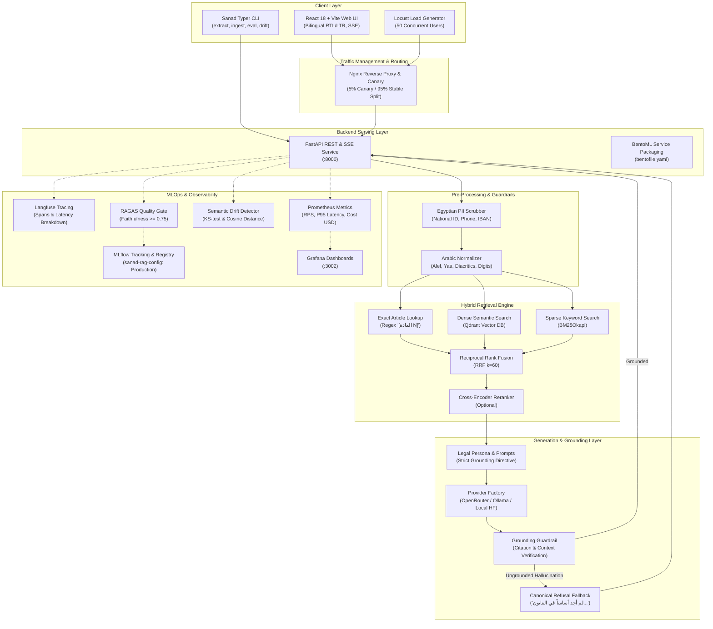

# Sanad (سند) — System Architecture

**Sanad** is a production-grade, bilingual Arabic/English legal Question-Answering and retrieval system grounded strictly in the **Egyptian Civil Code (القانون المدني المصري, Law No. 131 of 1948)**.

Developed for the **ITI x MLOps MENA "MLOps Practitioner"** program, Sanad applies strict MLOps principles across versioning, tracking, automated quality gates, distributed tracing, observability, and reproducible container serving.

---

## 1. High-Level Architecture Diagram

---

## 2. Core Architectural Pillars

### 2.1 Monorepo Separation of Concerns
The repository maintains strict boundary isolation between frontend and backend:
- `backend/`: Standard Python package under `src/sanad/` managed via `pyproject.toml`. Contains zero frontend code, dependencies, or build artifacts.
- `frontend/`: Single-page React 18 + Vite + TypeScript application in `frontend/`. Communicates with the backend exclusively via standard HTTP REST and Server-Sent Events (SSE). Can point to any arbitrary backend via `VITE_API_BASE_URL`.
- `infra/`: Independent infrastructure definitions (`docker-compose.yml`, Prometheus, Grafana, Nginx canary proxy).

### 2.2 Corpus Processing & Bilingual Reconciliation
The source text is extracted from `data/raw/egyptian_civil_code_1948.pdf` into `data/processed/articles.json`:
- **Geometry-Aware Column Splitting**: Two-column layout split at `x = 298.0 pt` (left column: English translation; right column: Arabic statute).
- **Contiguity Guarantee**: Exactly 1,149 articles from Article 1 through Article 1149, with zero gaps and zero duplicates.
- **Repealed Articles Preservation**: Articles 54–80 (Associations Law 384/1956) and Articles 389–417 (Evidence Law 25/1968) are preserved with `is_repealed: true` and formal statutory repeal notes.
- **Issuance Law Segregation**: The introductory Issuance Law (Articles 1–2) is stored separately in `data/processed/issuance_law.json` to prevent collision with primary Code article numbers.

### 2.3 Provider Abstraction & Model Registry
All models are declared declaratively in `config/models.yaml`:
- **Unified Interfaces**: `ChatProvider` (with `complete()` and async `stream()`) and `EmbeddingProvider` (with auto-detected dimensionality).
- **Providers Supported**: OpenRouter, standard OpenAI-compatible endpoints, Ollama, and local HuggingFace / SentenceTransformers.
- **Zero Code Modification**: Adding or updating models is purely a YAML configuration change.
- **Multi-Model Collections**: Vector database collections in Qdrant are dynamically named `sanad_{model_id}_{dim}_{corpus_hash}` to guarantee zero vector space contamination between embedding spaces.

### 2.4 Hybrid Retrieval & Strict Grounding
1. **Reciprocal Rank Fusion (RRF)**: Combines dense vector retrieval (Qdrant cosine similarity) with sparse keyword search (BM25Okapi over normalized Arabic text) using $k=60$.
2. **Deterministic Exact Article Lookup**: Regular expression intercepts queries explicitly mentioning article numbers (e.g., "المادة 147" or "Article 157") and injects the exact statutory article as Rank 1 with score 1.0.
3. **Citation Guardrail**: Answers must cite articles in square brackets (`[المادة N]` or `[Article N]`). If an answer cites an article outside the retrieved context, the grounding guardrail suppresses the response and returns the canonical refusal.
4. **Zero-Context Immediate Refusal**: If retrieval returns 0 articles or below minimum threshold, generation is skipped and the refusal is returned immediately.

### 2.5 Serving Layer
- **FastAPI Core**: Modular routes (`/ask`, `/ask/stream`, `/models`, `/articles/{number}`, `/corpus/stats`, `/admin/ingest`).
- **SSE Streaming**: Real-time token streaming (`/ask/stream`) adhering to standard `text/event-stream` protocol emitting `event: token`, `event: citations`, and `event: done`.
- **BentoML Packaging**: Service definition in `bento_service.py` with multi-cloud container deployment manifest in `bentofile.yaml`.

### 2.6 MLOps & Observability
- **MLflow Tracking**: Experiment tracking across 8+ configurations in `chunking_and_embedding`. Best configuration registered as `sanad-rag-config` and promoted to `Production`.
- **RAGAS Quality Gate**: Automated evaluation evaluating faithfulness, answer relevancy, context precision, context recall, hit rate, and MRR. The CI gate fails if faithfulness < 0.75.
- **Langfuse Distributed Tracing**: Granular spans (`normalize`, `retrieve`, `generate`, `guardrails`) with token attribution.
- **Prometheus & Grafana**: Exporting operational metrics, request latency histograms, LLM dollar cost estimates, and pre-built Grafana dashboards.
- **Embedding Drift Detection**: KS-test and cosine distance monitoring detecting shifts between query traffic and the statutory corpus centroid.
